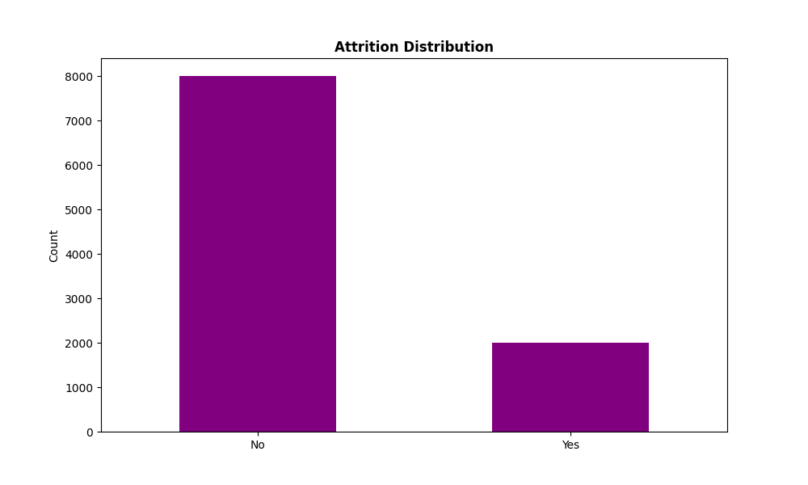
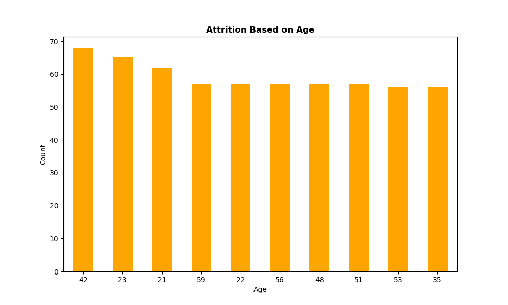
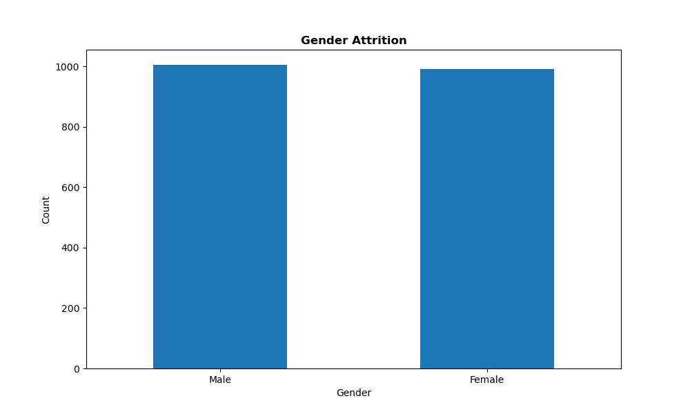

# Employee Attrition Analysis

## Overview

This project explores the critical issue of employee attrition using a structured data analytics approach. The goal is to identify key factors contributing to employee turnover and provide actionable insights for HR departments to proactively mitigate attrition risks. By leveraging statistical analysis, machine learning models, and clustering techniques, this project delivers both predictive and descriptive insights into workforce behavior.

## Objectives

- Understand what factors are most associated with employee attrition.
- Build predictive models to classify attrition risk.
- Provide insights that support the development of targeted retention strategies.
- Identify employee groups with shared characteristics that may influence attrition.

---

## Dataset

- **Source:** [Kaggle - Employee Attrition Prediction Dataset](https://www.kaggle.com/)
- **Size:** 10,000 employee records
- **Features:** Includes demographic information, job roles, compensation data, satisfaction ratings, and more (26 features in total).
- **Target Variable:** `Attrition` (Yes/No)

---

## Tools/Software Used

- Amazon Web Services (AWS)
  - Elastic MapReduce Spark/Hadoop/Jupyter Cluster
- Python
  - PySpark
  - Pandas API on Spark

---

## Methodology

### 1. Data Preprocessing

- No missing values or duplicates were present.
- No significant outliers or skewness detected across features.
- Dataset used as-is for analysis and modeling.

### 2. Exploratory Data Analysis (EDA)

Focused on discovering patterns within the attrited (left) employee population.

#### Attrition Count

#### Age Distribution of Attrited Employees

#### Gender vs. Attrition Count

#### Department vs. Attrition Count

- Attrition rates were highest among employees aged 21–23 and around age 42.
- Gender distribution among attrited employees was nearly equal.
- Finance and Marketing departments had the highest attrition rates, while HR and IT experienced the lowest. This suggests certain departments may face unique challenges affecting retention.

### 3. Predictive Modeling

Machine learning models were trained to predict the likelihood of employee attrition.

- **Models Used:**  
  - Logistic Regression  
  - Random Forest Classifier
- **Evaluation Metrics:** Accuracy, Precision, Recall, F1 Score
- **Optimization:** GridSearchCV for hyperparameter tuning

| Model                | Accuracy | Recall | Precision | F1 Score |
|---------------------|----------|--------|-----------|----------|
| Logistic Regression | 80.4%    | 80.4%  | 64.6%     | 71.7%    |
| Random Forest       | 78.7%    | 78.7%  | 68.7%     | 71.8%    |

### 4. Clustering Analysis

- **Technique:** K-Means Clustering
- **Outcome:** Silhouette score of ~0.13
- **Interpretation:** Weak clustering structure; data may not naturally group well by the features used.

---

## Key Findings

### Demographic Insights

- Attrition was nearly equal between genders.
- Higher attrition among employees aged 21–23 and 42.
- Single and divorced employees had higher attrition rates than married ones.

### Job-Related Insights

- Finance and Marketing had the highest attrition.
- Assistant-level roles showed the highest turnover.
- Extremes in project counts (1–3 or 8–9 projects) linked to more attrition.

### Tenure-Related Insights

- Spikes in attrition at 5, 10, and 23 years of company tenure.
- Longer durations without promotion (>2–3 years) correlated with higher attrition.

---

## Recommendations

### Demographics-Based
- Mentorship programs for younger employees.
- Wellness and flexibility initiatives for non-married employees.

### Job-Based
- Career development plans for Finance and Marketing.
- Enhanced onboarding and advancement paths for entry-level roles.
- Optimize project load management.

### Tenure-Based
- "Stay interviews" at key career milestones (5, 10, 20 years).
- Transparent and consistent promotion cycles.
- Role enrichment and job rotation programs.

---

## Limitations

- Lack of time-series data for trend analysis.
- Potential external variables not captured in the dataset.
- Weak clustering structure suggests limited segmentation ability.

---

## Conclusion

This project demonstrates how data-driven insights can enhance workforce management strategies. Through analysis and modeling, it becomes possible to identify at-risk employee segments and recommend targeted, evidence-based retention actions.

---

## Repository Contents

- `notebooks/`: Jupyter notebooks with analysis and modeling
- `data/`: Processed dataset used in the project
- `images/`: Visualizations used in this README

For any questions or collaboration opportunities, feel free to reach out via GitHub or LinkedIn.
